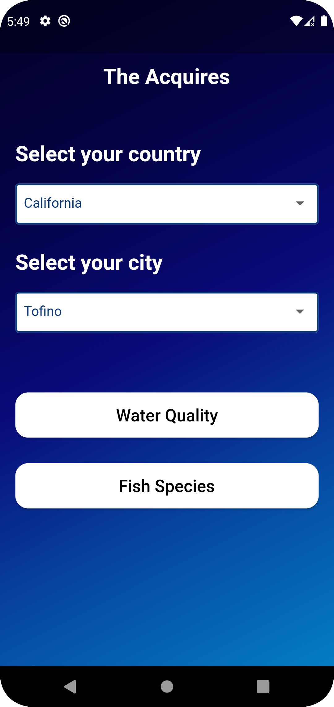
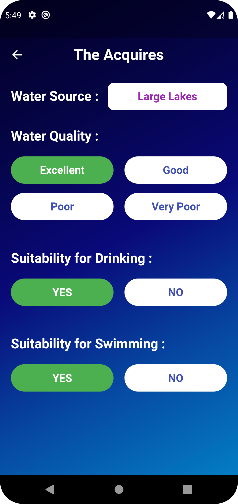
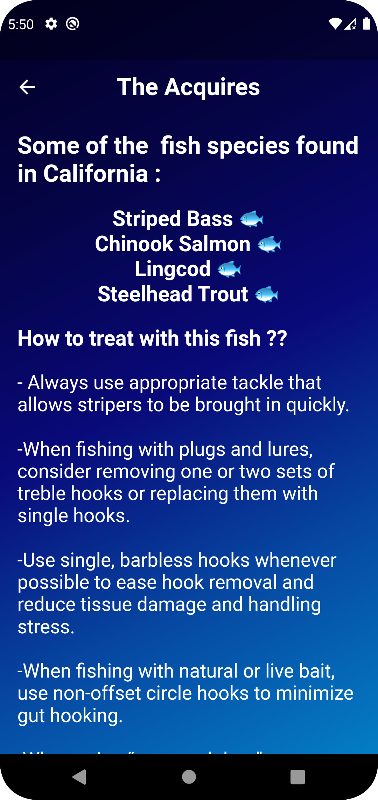

# Nasa Hackathon

A new Flutter project which contain some functionalities of our challenge at the hackathon (What's Up With Water?). There is a screen to enter the country and city, then the user will choose between two pages.

Home Page: 

  - The first is `Water.dart`, there are two information there can help the user (Drinkable, Swimmable).

    
    
  - the secon is `Fish.dart`, there are some of useful information in this page which can help the user to know more about the endangered species and how to protect them.

    

**That was a simple brief of the main functionalities in our application**,

Thank you for your time 😊
